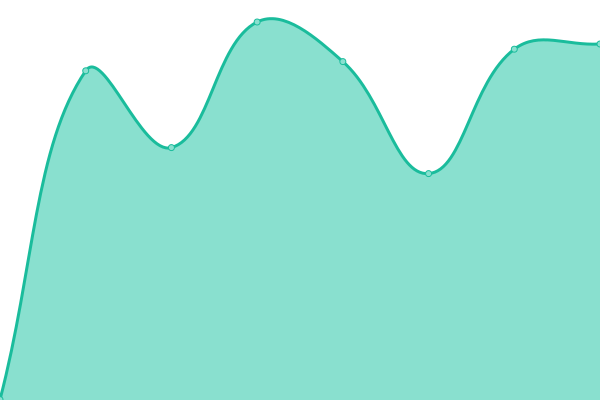
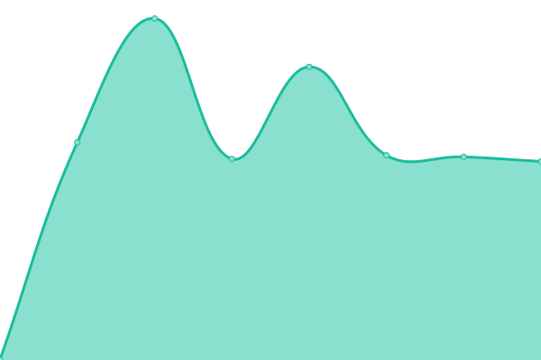

# [📈 Live Status](https://demo.upptime.js.org): <!--live status--> **🟩 All systems operational**

This repository contains the open-source uptime monitor and status page for [Stormkit.io](https://www.stormkit.io), powered by [Upptime](https://github.com/upptime/upptime).

With [Upptime](https://upptime.js.org), you can get your own unlimited and free uptime monitor and status page, powered entirely by a GitHub repository. We use [Issues](https://github.com/eldemcan/storm-test/issues) as incident reports, [Actions](https://github.com/eldemcan/storm-test/actions) as uptime monitors, and [Pages](https://demo.upptime.js.org) for the status page.

<!--start: status pages-->
<!-- This summary is generated by Upptime (https://github.com/upptime/upptime) -->
<!-- Do not edit this manually, your changes will be overwritten -->
<!-- prettier-ignore -->
| URL | Status | History | Response Time | Uptime |
| --- | ------ | ------- | ------------- | ------ |
|  [Stormkit Landing Page](https://www.stormkit.io/) | 🟩 Up | [stormkit-landing-page.yml](https://github.com/stormkit-io/stormkit-status/commits/HEAD/history/stormkit-landing-page.yml) | 

 730ms
     
 | 

<a href="https://stormkit-io.github.io/stormkit-status/history/stormkit-landing-page">100.00%</a>
    

|  [Stormkit Docs](https://www.stormkit.io/docs) | 🟩 Up | [stormkit-docs.yml](https://github.com/stormkit-io/stormkit-status/commits/HEAD/history/stormkit-docs.yml) | 

 308ms
     
 | 

<a href="https://stormkit-io.github.io/stormkit-status/history/stormkit-docs">100.00%</a>
    

|  [Stormkit Application](https://app.stormkit.io) | 🟩 Up | [stormkit-application.yml](https://github.com/stormkit-io/stormkit-status/commits/HEAD/history/stormkit-application.yml) | 

 634ms
     
 | 

<a href="https://stormkit-io.github.io/stormkit-status/history/stormkit-application">100.00%</a>
    

|  [Stormkit API](https://api.stormkit.io) | 🟩 Up | [stormkit-api.yml](https://github.com/stormkit-io/stormkit-status/commits/HEAD/history/stormkit-api.yml) | 

 599ms
     
 | 

<a href="https://stormkit-io.github.io/stormkit-status/history/stormkit-api">100.00%</a>
    

|  [Stormkit Api Canary](https://api.stormkit.io/?sk_canary=true) | 🟩 Up | [stormkit-api-canary.yml](https://github.com/stormkit-io/stormkit-status/commits/HEAD/history/stormkit-api-canary.yml) | 

 123ms
     
 | 

<a href="https://stormkit-io.github.io/stormkit-status/history/stormkit-api-canary">100.00%</a>
    

<!--end: status pages-->

[**Visit our status website →**](https://demo.upptime.js.org)

## 📄 License

- Powered by: [Upptime](https://github.com/upptime/upptime)
- Code: [MIT](./LICENSE) © [Can Eldem](www.caneldem.dev)
- Data in the `./history` directory: [Open Database License](https://opendatacommons.org/licenses/odbl/1-0/)
